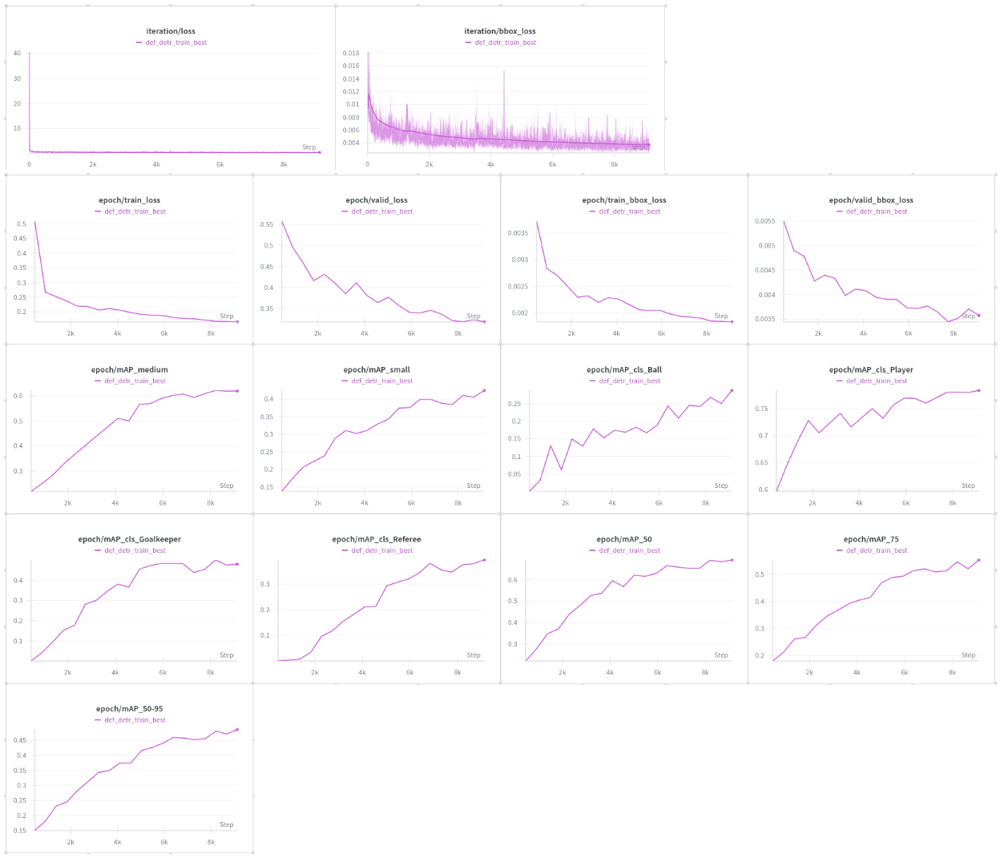
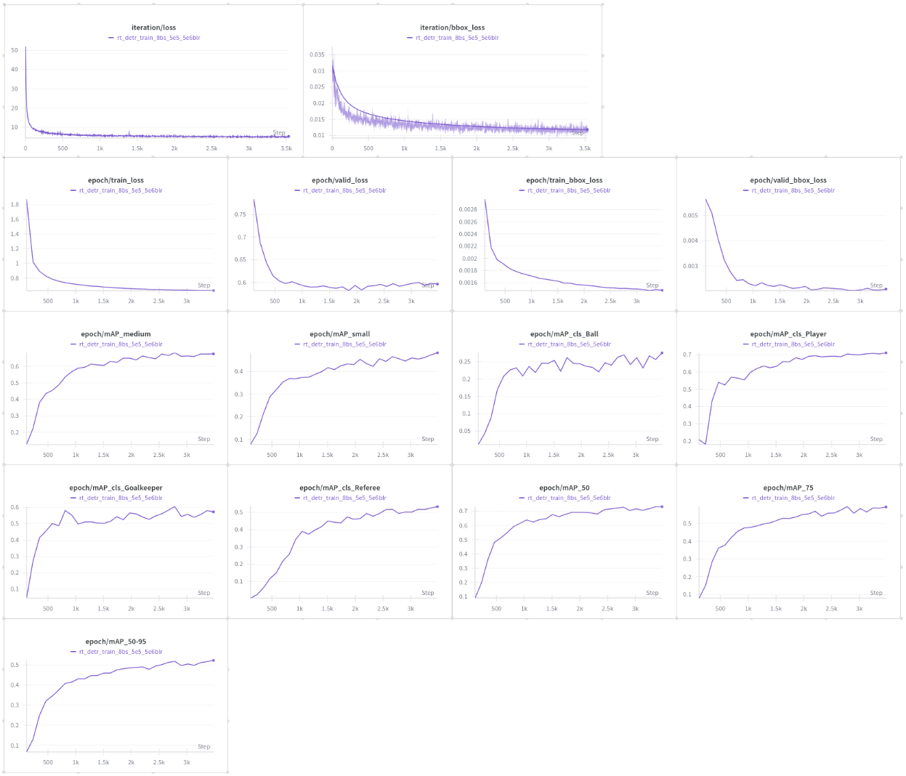

# FootballAI Project

---

## Overview
*FootballAI Project* is a computer vision project developed as part of a course in Computer Vision. The primary goal of this project is to track football players on the field using artificial intelligence. 
The system utilizes object detection models such as DETR to process video frames, annotate key elements of the game (such as players, referees, the ball, etc.).

This project has been refactored to enhance its modularity, scalability, and maintainability. The latest version incorporates improvements to both the underlying model architecture and the data processing pipeline.

---

## Project Background
This project was originally developed as part of a Computer Vision course, with the aim of applying machine learning techniques to real-world video analysis problems. 
Over time, the project has been refactored to improve its performance and extend its functionality, making it suitable for a variety of football game analysis tasks, including player tracking, event detection, and game summarization.

---

## Table of Contents
- [Overview](#overview)
- [Project Background](#project-background)
- [Project Structure](#project-structure)
- [Annotating Data](#annotating-data)
- [Loading Data](#loading-data)
- [Training Transformer Models](#training-transformer-models)

---

## Project Structure
```bash
football-ai/
├── configs/                       # Configuration files
│   └── config.yaml                  # Main configuration file
├── logger/                        # Logging utilities
│   └── wandb_logger.py              # Integration with WandB for logging
├── manager/                       # Checkpoint and model management
│   └── checkpoint_manager.py        # Checkpoint management functionality
├── models/                        # Model definitions and configurations
│   └── def_detr_model.py            # Model architecture for DETR
├── notebooks/                               # Jupyter Notebooks for experimentation
│   ├── annotate_data.ipynb                    # Notebook for data annotation
│   ├── def_detr_test_one_video.ipynb
│   ├── download_data.ipynb                    # Notebook for data download
│   ├── prepare_data_for_yolo_training.ipynb
│   ├── rt_detr_v2_test_one_video.ipynb
│   ├── test_load_dataset.ipynb                # Notebook for testing dataset loading
│   └── yolov11m_test_one_video.ipynb 
├── training/                          # Training scripts and configurations
│   ├── scripts/                         # Additional scripts for training
│   │   └── train_transformer_model.py     # Main training script
│   └── trainer/                         # Trainer classes and utilities
│       ├── evaluator.py                   # Model evaluation functionality
│       └── transformer_trainer.py         # Transformer model trainer
├── utils/                             # Utility functions and helpers
│   ├── data_utils/                      # Data handling utilities
│   │   ├── load_dataloader.py             # Dataloader management
│   │   └── load_dataset.py                # Dataset loading utilities
│   └── box_ops.py                       # Bounding box operations
├── .gitignore                     # Git ignore file
└── .venv/                         # Virtual environment for project dependencies
```

---

## Setting Environment Variables
Before downloading and training data, we need to set up the API keys that will be used in this project.

1. **ROBOFLOW_API_KEY**: This key is required because we will be downloading data and using models from the Roboflow website.
2. **WANDB_API_KEY**: This key is optional. You only need it if you want to track your training results with Weights & Biases (WandB). If you don’t plan to use WandB for logging or model tracking, you can skip this step.

To set up these variables, create a `.env` file in the project root and paste your API keys as follows:
```bash
ROBOFLOW_API_KEY=<your roboflow api key>
WANDB_API_KEY=<your wandb api key>
```

---

## Downloading Data
The dataset for this project has been obtained from two sources:

1. **Google Drive**: The data consists of short video clips from football matches, which were used for training and evaluation. To prevent almost identical frames from being selected, every 5th frame was chosen, with the frame selection controlled by setting `stride=5`. The data processing and splitting into folders is done in the notebook `notebooks/download_data.ipynb`.

2. **Roboflow**: The dataset provided by Roboflow already contained labeled frames, so there was no need to extract frames manually. The dataset was ready for training and evaluation without further preprocessing.

Both datasets are downloaded and processed in the notebook `notebooks/download_data.ipynb`. After running the notebook, a folder called `data` will be created in the project directory. It will contain the following structure with images extracted from the videos:
```bash
├── data/
│  ├── train/ 
│  │   └── images/ (905 images)
│  │       ├── image_1.jpg
│  │       ├── image_2.jpg
│  │       │       ...
│  │       └── image_xyz.jpg
│  └── valid/
│  │   └── images/ (124 images)
│  │       ├── image_1.jpg
│  │       ├── image_2.jpg
│  │       │       ...
│  │       └── image_xyz.jpg
│  ├── test/
│  │   └── images/  (93 images)
│  │       ├── image_1.jpg
│  │       ├── image_2.jpg
│  │       │       ...
│  │       └── image_xyz.jpg
│  │   
│  └── origin_videos (5 videos)
│
```
 
---

## Annotating Data
Once we have downloaded the data, we can proceed to annotate it. The notebook to annotate the data can be found in `notebooks/annotate_data.ipynb`.

To annotate the data, I used a pre-trained YOLO model, specifically trained for this type of image. This model was sourced from Roboflow. 
First, the model was tested on a few samples to verify its performance on the dataset. After confirming that the model performed well, the entire dataset was annotated with bounding boxes and labels.

The most important steps at this stage are:
1. The confidence threshold was set to 0.3 to avoid poor predictions and reduce clutter in the dataset.
2. The Intersection over Union (IoU) threshold was set to 0.5 to eliminate duplicate predictions and select the most confident prediction for each object.
3. The predictions were saved as the COCO JSON format, with bounding box coordinates (x, y, width, height) in absolute pixel values, where (x, y) refers to the top-left corner of the box.
> ⚠️ Note: Category identifiers saved at this stage start at 1, because several transformer-based models require index 0 to refer to the background. This is due to the architecture and operation of these models.

After running the notebook, each folder in the `data` directory will contain its own `coco_annotations` folder. Inside each `coco_annotations` folder, 
you will find an `annotations.json` file with the corresponding annotations for the images in that folder. The data folder should look like the following structure:
```bash
├── data/
│  ├── train/ 
│  │   └── images/
│  │   └── coco_annotations/
│  │       └── annotations.json
│  └── valid/
│  │   └── images/
│  │   └── coco_annotations/
│  │       └── annotations.json
│  ├── test/
│  │   └── images/
│  │   └── coco_annotations/
│  │       └── annotations.json
│  │   
│  └── origin_videos (5 videos)
│
```

---

## Loading Data

The project uses a custom dataset loader and a wrapper function for building PyTorch dataloaders.  
These utilities ensure that images, annotations, and augmentations are handled in a consistent and model-compatible way.

### `LoadDataset`

`LoadDataset` is a custom class that inherits from PyTorch’s `Dataset`.  
Its purpose is to:

- load images from disk,
- parse COCO-style annotations,
- apply Albumentations transforms (if provided),
- convert bounding boxes to the desired output format,
- return data in the `(image, target)` structure required by transformer-based detection models.

You can find the implementation in: `utils/data_utils/load_dataset.py`

#### Arguments
| Argument | Type | Description |
|---------|------|-------------|
| `dataset_dir_path` | `Path` | Path to the directory containing image files (`train/images`, `valid/images`, etc.). |
| `coco_annotations_path` | `Path` | Path to the COCO `annotations.json` file for the dataset split. |
| `set_ratio` | `float \| int \| None` | Allows loading only a selected percentage or number of samples. Useful for debugging. |
| `transforms` | `albumentations.Compose \| None` | Image augmentations applied during loading. |
| `desire_bbox_format` | `str` | The required bounding box format (`xywh`, `cxcywh`, etc.). |
| `return_img_path` | `bool` | If `True`, the dataset also returns the image path together with the sample. |
  
### `load_dataloader`

The `load_dataloader` function is a convenient wrapper around `LoadDataset` and PyTorch’s `DataLoader`.  
It builds a fully configured dataloader for training or validation.

You can find it in: `utils/data_utils/load_dataloader.py`

#### Functionality

- Initializes a `LoadDataset` instance,
- optionally loads a custom category mapping,
- wraps the dataset in a PyTorch `DataLoader`,
- applies a custom `collate_fn` to support variable numbers of objects per image.

#### Arguments

| Argument | Type | Description |
|---------|------|-------------|
| `root_dir` | `Path \| str` | Path to the folder with image files. |
| `coco_path` | `Path \| str` | Path to the COCO annotation JSON file. |
| `set_ratio` | `float \| int \| None` | Same as in `LoadDataset`: limits the dataset size. |
| `custom_categories` | `dict[str, Any] \| None` | Optional custom class-name–to-id mapping. |
| `batch_size` | `int` | Number of samples per batch. |
| `shuffle` | `bool` | Whether to shuffle the dataset. |
| `transform_func` | `albumentations.Compose \| None` | Albumentations pipeline applied inside the dataset. |
| `desire_bbox_format` | `str` | Bounding box output format expected by the model. |
| `pin_memory` | `bool` | Enables `pin_memory=True` for faster host-to-GPU transfers. |

---

## Training Transformer Models
To train transformer-based object detection models (e.g., Deformable DETR or RT-DETR-V2), a custom training class named `TransformerTrainer` was implemented.  
Although the Hugging Face `Trainer` class could be used, a custom solution was chosen intentionally — mainly to maintain full control over the training loop, support additional features (e.g., mAP per class, frequency-based validation, custom checkpointing), and to better understand the mechanics behind training transformer architectures.

The full implementation of the trainer can be found in: `training/trainer/transformer_trainer.py`

### `TransformerTrainer`

`TransformerTrainer` is a flexible training module designed specifically for object detection models built with the Hugging Face Transformers library.  
It handles the following:

- full training loop with epoch- and iteration-level logging,
- computation and aggregation of model losses (`loss`, `loss_bbox`),
- configurable optimizer and learning-rate scheduler,
- validation at custom frequency,
- mAP evaluation (via the custom `Evaluator` class),
- checkpoint saving using `ModelCheckpointManager`,
- logging to Weights & Biases using `WandbLogger`.

The trainer accepts a wide range of parameters, allowing the user to precisely configure the training process.

#### Key Arguments

| Argument | Type | Description |
|---------|------|-------------|
| `model` | `nn.Module` | The transformer detection model to train. |
| `train_dataloader` | `DataLoader` | Dataloader for the training split. |
| `valid_dataloader` | `DataLoader \| None` | Optional validation dataloader. |
| `frequency_validating` | `int \| None` | Allows running validation every N iterations. |
| `score_threshold` | `float` | Score threshold for filtering model predictions during evaluation. |
| `n_epochs` | `int` | Number of training epochs. |
| `optimizer` | `str` | One of: `"adamw"`, `"adam"`, `"sgd"`. |
| `optimizer_params` | `dict \| None` | Parameters passed to the optimizer (supports custom backbone LR). |
| `lr_scheduler` | `str \| None` | One of: `"cosine_annealing"`, `"step"`, `"onecycle"`. |
| `lr_scheduler_params` | `dict \| None` | Parameters for the chosen scheduler. |
| `checkpoint_manager` | `ModelCheckpointManager \| None` | Utility for saving model checkpoints. |
| `frequency_saving_checkpoint` | `int \| None` | Allows saving checkpoints every N iterations. |
| `wandb_logger` | `WandbLogger \| None` | Optional Weights & Biases logger. |
| `map_per_class` | `bool` | Enables mAP calculation for each class separately. |

---

### Training Loop Overview

The trainer follows a classical loop structure:

1. **Forward pass**  
   The model receives a batch and returns all loss components through `outputs.loss` and `outputs.loss_dict`.

2. **Backward pass & optimizer step**  
   Loss gradients are cleared, computed, and applied.

3. **Logging**  
   - iteration-level logging (optional, to W&B),  
   - epoch summaries (loss, bbox loss, mAP).

4. **Validation**  
   - can run once per epoch or based on `frequency_validating`,  
   - predictions and targets are post-processed for the `Evaluator`.

5. **Checkpointing**  
   - at the end of each epoch,  
   - optionally every *N* iterations.

This setup provides full transparency and control over training — which was one of the key reasons to implement a custom trainer instead of relying on the built-in Hugging Face `Trainer`.

---

### Main Training Configuration

Before presenting the trained models and their results, the main configuration structure used for training is outlined below.  
The configurations for models training is stored in: `configs/<model>_training_config.yaml`.

It is organized into several logical blocks, each responsible for a specific part of the training pipeline.  
Below is an overview of what each field represents (without exposing specific values).
  
#### **config.yaml file**

```yaml
paths:
  project_root: <path_to_project_root>               # Absolute path to the project root.
  train:
    images: <path_to_training_images>                # Directory with training images.
    annotations: <path_to_training_annotations_json> # COCO annotations for the training split.
  valid:
    images: <path_to_validation_images>              # Directory with validation images.
    annotations: <path_to_validation_annotations_json> # COCO annotations for the validation split.

training:
  num_epochs: <number_of_epochs>                     # Total number of training epochs.
  batch_size: <batch_size>                           # Number of samples per batch.
  train_set_ratio: <subset_ratio_or_null>            # If null → full dataset is used.
  valid_set_ratio: <subset_ratio_or_null>            # If null → full dataset is used.
  frequency_validating: <validate_every_n_iterations_or_null> # If null → validate once per epoch.
  score_threshold: <model_score_threshold>           # Minimum score for predicted boxes.
  save_checkpoints: <true_or_false>                  # Whether checkpoints should be saved.
  checkpoint_dir_path: <path_or_null>                # If null → default directory is used.
  max_checkpoints: <max_number_of_checkpoints>       # How many latest checkpoints to keep.
  frequency_saving_checkpoint: <save_every_n_iterations>  # If null → save checkpoint once per epoch. Only if save_checkpoints is True 
  log_metrics: <true_or_false>                       # Enables/disables metric logging (W&B).
  map_per_class: <true_or_false>                     # Requires log_metrics=true; computes per-class mAP.
  shuffle: <true_or_false>                           # Shuffle training dataset each epoch.
  desire_bbox_format: <bbox_format>                  # Output format for bounding boxes (e.g., xywh).
  augmentation: <true_or_false>                      # Enable/disable Albumentations transforms.
  pin_memory: <true_or_false>                        # DataLoader optimization for GPU training.
  device: <device>                                    # Typically "cuda" or "cpu".

model:
  model_id: <huggingface_model_id>                   # Hugging Face model identifier for loading weights.
  id2label:
    <class_id>: <class_name>                         # Using custom class IDs. If null then the basic classes from the configuration of the specific model will be used 
  device: <device>                                    # Inherits from training.device.
  reset_head: <true_or_false>                        # If true → reinitializes classification head. It is necessary in the case of custom classes.

optimizer:
  type: <optimizer_name>                             # One of: adamw, adam, sgd.
  params:
    lr: <learning_rate>                              # Learning rate for non-backbone parameters.
    backbone_lr: <backbone_learning_rate>            # Optional; if null →  all learning layers will be assigned lr.
    weight_decay: <weight_decay>                     # If null → default optimizer weight decay is used.

scheduler:
  type: <scheduler_type_or_null>                     # If null → scheduler is not used.
  params:
    T_max: <max_cycles_or_epochs>                    # Scheduler-specific; ignored if scheduler.type is null.
    eta_min: <minimum_learning_rate>                 # Optional; if null → default value is used.

wandb_logger:
  project_name: <wandb_project_name>                 # Name of the W&B project; ignored if log_metrics is False.
```

---

### `Training Deformable DETR Model`

`DefDetrModel` is a wrapper module built around the Hugging Face `DeformableDetrForObjectDetection` architecture.  
The implementation of DefDetrModel wrapper can be found in: `models/def_detr_model.py`  
The goal of this class is to provide a clean, unified interface for:

- loading pretrained Deformable DETR models,
- customizing label mappings (`id2label`),
- resetting classification heads for fine-tuning on new datasets,
- performing forward passes for both training and inference,
- loading checkpoints saved during training,
- loading models directly from a Hugging Face Hub repository.

This wrapper integrates seamlessly with the `TransformerTrainer` and ensures that images, annotations, and predictions are processed in a format suitable for  
transformer-based object detection.

---

#### Key Features

##### ✔️ Configurable label space  
If `id2label` is passed during initialization, the model automatically:

- updates `config.id2label`,
- sets `config.label2id`,
- adjusts the classification head for the correct number of classes.

This makes the model fully adaptable to custom datasets (e.g., your FootballAI dataset).

##### ✔️ Optional head reset  
When `reset_head=True`, the classification layers are re-initialized using Xavier initialization —  
useful when fine-tuning on newly annotated datasets with different label distributions.

##### ✔️ Built-in processor  
The model loads `DeformableDetrImageProcessor` and uses it internally for:

- image normalization,
- padding,
- conversion of annotations to model-friendly tensors.

This allows you to pass raw images and COCO-like annotations directly to the model.

##### ✔️ Seamless checkpoint loading  
The `load_model_checkpoint()` method loads:

- full model weights,
- full config,
- restores label mappings,
- reloads/reinitializes heads if the number of classes has changed.

Compatible with checkpoints saved by your `ModelCheckpointManager`.

##### ✔️ Hugging Face Hub support  
The `from_pretrained()` class method allows loading the model directly from a Hub repository  
including `.safetensors` weights.  
This is especially useful for sharing trained detectors with collaborators.

---

#### Used config to train the model

```yaml
# Main configuration for the training process
paths:
  project_root: <project_root_dir_path>
  train:
    images: '${paths.project_root}/data/train/images'
    annotations: '${paths.project_root}/data/train/coco_annotations/annotations.json'
  valid:
    images: '${paths.project_root}/data/valid/images'
    annotations: '${paths.project_root}/data/valid/coco_annotations/annotations.json'

training:
  num_epochs: 20
  batch_size: 2
  train_set_ratio: null
  valid_set_ratio: null
  frequency_validating: null
  score_threshold: 0.3
  save_checkpoints: true
  checkpoint_dir_path: null
  max_checkpoints: 5 
  frequency_saving_checkpoint: 200
  log_metrics: true
  map_per_class: true
  shuffle: true
  desire_bbox_format: xywh
  augmentation: true
  pin_memory: true
  device: 'cuda'

# Model configuration
model:
  model_id: SenseTime/deformable-detr
  id2label:
    0: 'N/A'
    1: 'Ball'
    2: 'Goalkeeper'
    3: 'Player'
    4: 'Referee'
  device: ${training.device}
  reset_head: true

# Optimizer configuration
optimizer:
  type: adamw  # Default
  params:
    lr: 5e-4
    backbone_lr: 1e-6
    weight_decay: 0.01

# Scheduler configuration
scheduler:
  type: cosine_annealing
  params:
    T_max: ${training.num_epochs}
    eta_min: 1e-6
  
wandb_logger:
  project_name: football-ai
```

---

#### Training Results for Deformable DETR

The Deformable DETR model was trained on a rented GPU from Vast.ai —  
**NVIDIA RTX 3090 Ti with 24 GB of VRAM**.  
Despite using such a powerful GPU, the training process was still relatively long due to the computational cost of transformer-based object detection models.  
This is expected for architectures like Deformable DETR, which require high-resolution inputs and operate with multi-head attention over spatial features.

Below are the training results, including iteration-level losses, epoch-level losses, and mAP metrics across object sizes and classes.

  
##### **1. Iteration-Level Losses**

- **`iteration/loss`**  
  The total loss decreases rapidly during the early iterations and then stabilizes.  
  The curve remains smooth, showing no instability or divergence.

- **`iteration/bbox_loss`**  
  Bounding-box regression loss follows the same trend, with expected noise from iteration-to-iteration updates.
  
##### **2. Epoch-Level Losses**

- **`epoch/train_loss`** and **`epoch/valid_loss`**  
  Both losses drop consistently throughout training.  
  Validation loss closely follows the training loss, indicating healthy generalization and no overfitting.

- **`epoch/train_bbox_loss`** and **`epoch/valid_bbox_loss`**  
  Both decline steadily, confirming improvements in bounding-box localization.
  
##### **3. Size-Based mAP Metrics**

- **`epoch/mAP_medium`**  
  Medium-sized objects achieve stable and strong improvements across epochs.

- **`epoch/mAP_small`**  
  Shows a clear upward trend, although with slightly slower growth, which is typical for small objects like the ball.
  
##### **4. Class-Specific mAP Metrics**

- **Ball**  
  Despite being a small and fast-moving object, the model learns to detect it effectively.

- **Player**  
  The best-performing class — rapid improvement and consistently high mAP.

- **Goalkeeper**  
  Harder to detect due to visual similarity to players and fewer examples, but the metric still increases steadily.

- **Referee**  
  mAP also rises over the epochs, though slightly slower due to limited samples.
  
##### **5. Global Detection Metrics**

- **`epoch/mAP_50`**  
  Shows a strong and consistent rise, indicating improving coarse localization.

- **`epoch/mAP_75`**  
  Increases more gradually, reflecting the difficulty of achieving high-IoU matches.

- **`epoch/mAP_50-95`**  
  Demonstrates continuous improvement across all IoU thresholds.
  
#### Summary

The training curves show a clear and consistent **upward trend** across all loss components and mAP metrics.  
This strongly suggests that:

- the model did **not** reach full convergence,  
- further training would likely continue improving both localization and classification performance,  
- additional epochs or fine-tuning could yield even better results,  
- the pipeline is stable and scales well even on demanding transformer architectures.
Despite the long training time on an RTX 3090 Ti (24 GB VRAM), the model learned steadily and shows significant potential for further improvements.

---

### `Training RT-DETRv2 Model`

`RTDetrV2Model` is a wrapper module built around the Hugging Face  
`RTDetrV2ForObjectDetection` architecture.  
The implementation of the wrapper can be found in:  
`models/rt_detrv2_model.py`

Although the same training pipeline (`TransformerTrainer`) was used for both models,  
**the only meaningful difference lies in the model wrapper itself**:
- RT-DETRv2’s forward pass **does not use `pixel_mask`**,

---

#### Used config to train the model

```yaml
paths:
  project_root: <project_root_dir_path>
  train:
    images: '${paths.project_root}/data/train/images'
    annotations: '${paths.project_root}/data/train/coco_annotations/annotations.json'
  valid:
    images: '${paths.project_root}/data/valid/images'
    annotations: '${paths.project_root}/data/valid/coco_annotations/annotations.json'

training:
  num_epochs: 40
  batch_size: 8
  train_set_ratio: null
  valid_set_ratio: null 
  frequency_validating: null
  score_threshold: 0.3
  save_checkpoints: true
  checkpoint_dir_path: null        
  max_checkpoints: 5              
  frequency_saving_checkpoint: 60 
  log_metrics: true
  map_per_class: true
  shuffle: true
  desire_bbox_format: xywh
  augmentation: true
  pin_memory: true
  device: 'cuda'

# Model configuration
model:
  model_id: PekingU/rtdetr_v2_r18vd
  id2label:
    0: 'Ball'
    1: 'Goalkeeper'
    2: 'Player'
    3: 'Referee'
  device: ${training.device}
  reset_head: true

# Optimizer configuration
optimizer:
  type: adamw  # Default
  params:
    lr: 5e-5
    backbone_lr: 5e-6
    weight_decay: 0.01

# Scheduler configuration
scheduler:
  type: cosine_annealing  # If you don't want to use scheduler the set the type as null
  params:
    T_max: ${training.num_epochs}
    eta_min: 1e-6
  
wandb_logger:
  project_name: football-ai
```
  
As you can see in the configuration above, the class indexing for RT-DETRv2 starts from **0** instead of **1**.  
This is required because **RT-DETR does not use a background class**, unlike Deformable DETR.

In Deformable DETR, the label mapping typically starts with:
- `0: "N/A"` – an explicit background class  
- real object classes begin from index **1**

RT-DETRv2 works differently. It does **not** include a background label in the class embeddings.  
Because of this, all object classes must start from index **0**, and no `"N/A"` entry should be included.

---

#### Training Results for RT-DETRv2

The following plots present the complete training progress for the RT-DETRv2 model.  
RT-DETRv2 is optimized for real-time performance while maintaining strong accuracy, and the training curves confirm stable convergence and consistent improvements across all metrics.

As in the Deformable DETR experiment, the model was trained on a rented  
**NVIDIA RTX 3090 Ti (24 GB VRAM)** from Vast.ai.  

  
##### **1. Iteration-Level Losses**

- **`iteration/loss`**  
  The overall loss drops rapidly during the first few hundred iterations and stabilizes smoothly.  
  The curve shows stable optimization with no oscillations or divergence.

- **`iteration/bbox_loss`**  
  Bounding-box loss follows a clear downward trajectory.  
  Although per-iteration values are noisy (expected for dense detection),  
  the global trend is clearly descending.
  
##### **2. Epoch-Level Losses**

- **`epoch/train_loss`** and **`epoch/valid_loss`**  
  Both curves steadily decrease over the training epochs.  
  Validation loss remains close to training loss, indicating:
  - good generalization,
  - no overfitting,
  - stable optimization dynamics.

- **`epoch/train_bbox_loss`** and **`epoch/valid_bbox_loss`**  
  Both bounding-box regression losses decline consistently, confirming  
  improved localization accuracy throughout training.
  
##### **3. Size-Based mAP Metrics**

- **`epoch/mAP_medium`**  
  Shows a strong and smooth upward trend, indicating reliable detection of medium-sized objects (players at moderate distances).

- **`epoch/mAP_small`**  
  Improves consistently, despite the inherent difficulty of detecting small objects such as distant players or the ball.  
  The upward trajectory suggests the model had not yet fully converged and could benefit from further training.
  
##### **4. Class-Specific mAP Metrics**

- **Ball**  
  The model manages to learn this challenging class effectively.  
  The metric grows steadily, with noticeable variability typical for small, fast-moving objects.

- **Player**  
  One of the strongest-performing classes.  
  mAP rises quickly and remains high across epochs.

- **Goalkeeper**  
  mAP improves throughout training, though at a slower pace due to fewer samples  
  and visual similarity to regular players.

- **Referee**  
  Shows a consistent and stable increase, despite class imbalance.
  
##### **5. Global Detection Metrics**

- **`epoch/mAP_50`**  
  Rises sharply and reaches strong values early in training, confirming  
  good coarse localization performance.

- **`epoch/mAP_75`**  
  Improves more gradually, reflecting the difficulty of achieving high IoU overlap.

- **`epoch/mAP_50-95`**  
  Demonstrates steady improvements across multiple IoU thresholds,  
  indicating that both localization and classification become more precise as training progresses.
  
##### Summary

The RT-DETRv2 results exhibit:

- stable and smooth convergence across all loss components,
- strong generalization between training and validation sets,
- consistent growth in mAP metrics for all object classes,
- reliable detection of both medium and small objects,
- no signs of overfitting or training collapse.

Importantly, most curves — especially mAP —  
show a **clear upward trend even at the end of training**, suggesting that  
**additional epochs would likely further improve the model's performance**.

Overall, RT-DETRv2 demonstrates excellent learning behaviour on the FootballAI dataset  
and shows significant potential with extended training.

---

## Training YOLOv11m Model

### Preparing Data for YOLO Model Training

The dataset used for training the transformer-based models (Deformable DETR and RT-DETRv2) was originally stored in **COCO format**, where all annotations for each split are stored in a single file:

```
annotations.json
```

In the COCO specification, bounding boxes are saved as:

```
[x_min, y_min, width, height]   # xywh in pixels
```

This means:
- coordinates are absolute pixel values,
- the format represents the top-left corner + width + height.

However, YOLO requires a completely different structure and representation.

For YOLO, **each image must have its own `.txt` label file**, located under a `labels/` directory, and each bounding box must follow the format:

```
<class_id> <x_center> <y_center> <width> <height>
```

Where:
- values are in **cxcywh format**,  
- all numbers are **normalized to the range [0, 1]** relative to the image width and height,
- no pixel coordinates are allowed.

Therefore:
- **COCO → xywh (pixels)**  
- **YOLO → cxcywh (normalized)**

A valid YOLO dataset follows this structure:

```
train/
  images/
    img_001.jpg
    img_002.jpg
    ...
  labels/
    img_001.txt
    img_002.txt
    ...
```
To perform this conversion from COCO to YOLO format, a dedicated notebook was created that could be found in: `notebooks/prepare_data_for_yolo_training.ipynb`  
The notebook also automatically generated the YOLO configuration file `data/data.yaml`

This file is required by the Ultralytics training pipeline and contains:

- paths to the **training** and **validation** image directories,
- the total **number of classes**,
- the list of **class names** used by the YOLO model.

### Training Setup

The YOLOv11m model was trained using a rented GPU instance on **Vast.ai**, similarly to the training setup used for the transformer-based models.  
However, in this case the training was executed directly from the terminal using the Ultralytics CLI interface.

The following command was used to launch the full training process:
```
yolo task=detect train model=yolo11m.pt data=data/data.yaml epochs=100 imgsz=640 batch=32 lr0=0.0001 device=0 project=training_runs name=exp_big
```
  
Where:
- `model=yolo11m.pt` — selects the YOLOv11m architecture,
- `data=data/data.yaml` — path to the YOLO-formatted dataset,
- `epochs=100` — number of training epochs,
- `imgsz=640` — image resolution used during training,
- `batch=32` — batch size,
- `lr0=0.0001` — initial learning rate,
- `device=0` — GPU index in Vast.ai instance,
- `project=training_runs` and `name=exp_big` — define the output directory for experiment logs and weights.

This workflow allowed fast, large-batch training of YOLOv11m on high-performance hardware.

---

### Model Comparison

Below is a visual comparison of the three trained models.  

#### Visual Results (GIFs)

##### Deformable DETR


##### RT-DETRv2


##### YOLOv11m


---

#### Deformable DETR — more stable, but still struggles with the ball
Deformable DETR performs visibly better than RT-DETRv2 when tested on full-pitch video.

- Player detections are **more consistent** and less prone to frame-to-frame flickering.  
- However, the model still **struggles to detect the ball**, which is often missed or detected inconsistently.  
- Overall tracking is smoother, but not yet reliable for complete match analysis.

**Summary:** good overall stability, but ball detection remains a significant weakness.

---

#### RT-DETRv2 — weakest real-world performance
Although RT-DETRv2 achieved better metrics during training than Deformable DETR (mAP, mAP@50, mAP@75), its behavior during video inference was noticeably worse.

- The model frequently **loses the ball**, especially when it moves quickly or becomes partially occluded.  
- It also occasionally **drops players**, particularly those further away in the frame.  
- Bounding boxes tend to be unstable and “jump” between frames.

**Summary:** excellent metrics, but poor stability and reliability in real match footage.

---

#### YOLOv11m — best practical performance
YOLOv11m turned out to be the most reliable model during real video inference.

- Player positions are **stable across frames**, with minimal flickering.  
- The model handles occlusions better and maintains consistent detections.  
- Detection of the ball is still challenging due to its small size and motion blur, but overall performance is stronger than in the transformer-based models.

**Summary:** the most practical model for detecting players and referees on full-pitch footage, despite difficulties with the ball.

---

#### ⚠️ **Important Note on Training Duration**

**All three models were trained for a relatively short period of time**, and none of them reached the point of clear metric stabilization (mAP, mAP@50–95, bbox loss).  
This means the training curves were still showing upward or downward trends at the end of training.

➡️ **Therefore, the qualitative results shown above do *not* represent the full potential of these models.**  
➡️ **If trained longer, each model would almost certainly achieve significantly better accuracy and stability during inference.**

This should be considered when interpreting the comparison.

---

#### Summary & Recommended Next Step

Despite RT-DETRv2 achieving the highest training metrics, **YOLOv11m outperformed all models in real-world inference** thanks to its stability and robustness.

Both RT-DETRv2 and Deformable DETR suffer from inconsistent ball detection, while YOLOv11m also struggles but remains the most stable option overall.

##### ✔️ Recommended approach

Based on the results, the next step should be the addition of a **separate lightweight detector specialized only for ball detection**.  
A dedicated model focused solely on the ball would significantly improve overall tracking when combined with the main player/referee detector.

##### ✔️ Testing inference and processing speed

To reproduce the inference tests and evaluate the processing speed of each model, you can use the provided notebooks:

- `notebooks/def_detr_test_one_video.ipynb`  
- `notebooks/rt_detr_v2_test_one_video.ipynb`  
- `notebooks/yolov11m_test_one_video.ipynb`

These notebooks allow you to run inference on a full match clip, generate processed videos, and measure execution time for each model.
